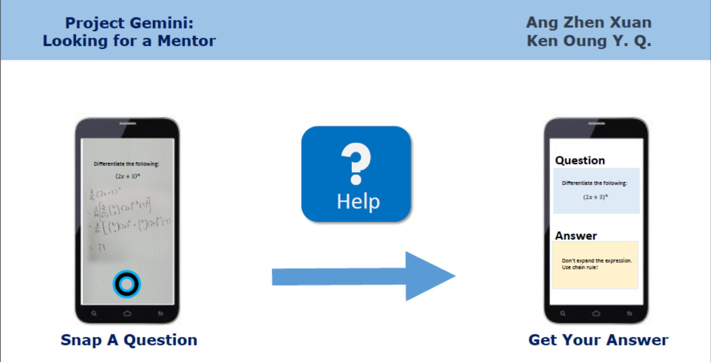

# Project README

A web-based Q&A platform with a focus on image-based questions.

Our current target is Project Gemini, the intermediate level of achievement. The
main inspiration for this project was our daily struggle with schoolwork, and 
our inability to get timely help. By adding image support to Q&A, we hope to 
create an easy-to-use platform for students to get quick detailed useful answers
to their questions.

## Team HELP
Students Involved:
- Ang Zhen Xuan
- Ken Oung Yong Quan

## Scope of Project
### Target Groups
Students in NUS who are in dire need of assistance for their work
or revision.

### Future Plans
Could see the scope of operations being expanded into primary and secondary 
education institutes.

## Features
1. Posting questions
2. Reply questions 
3. Allowing image upload for both questions and replies
4. Voice upload

## User Stories
1. As a user, I would like to be able to obtain instant replies from users who
have rectified my uploaded problem set.
2. As a user, I would like to upload my problem set onto the server in the form
of a picture.
3. As a user, I would like to have the accompaniment of a voice note to the 
uploaded solution, aiding the user to a better understanding of my working.

## Project Log
TODO: Add link to project log

## Kickoff Video
Here's a link to our KickOff Presentation.
https://youtu.be/hK8Z0QLRlbU?t=57m52s (Hanger 57:52 - 59:00)

## License
This project is licensed under the MIT license. Please refer to LICENSE for further details.